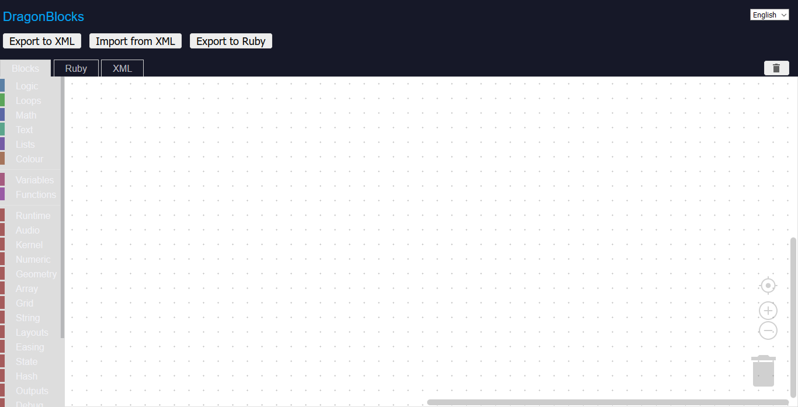

# DragonBlocks

[Blockly](https://developers.google.com/blockly)-based environment made for [DragonRuby Game Toolkit](https://dragonruby.org/toolkit/game), Based on Blockly version `blockly-6.20210701.0` by Google.



## Usage

#### Buttons

1. Export to XML: Exports the Blocks to XML file, Thus can be used later to continue coding by import.

2. Import from XML: Loads Blocks from XML file.

3. Export to Ruby: Exports the Blocks to Ruby file.

> NOTICE: Link and Run button deleted from Blockly, Also non-English languages were deleted but if you want to add your language translate the blocks then open isssue/pull request for that.

#### Blocks

The Blocks from Blockly were kept with some improvements, Including addition of some blocks to supply them plus that DragonRuby blocks were added based on the APIs, The blocks generate mruby-Compatible code and works with DragonRuby!

#### Source Code and Offline Mode

Blocks have been written via JavaScript, JSON, And XML, In addition to Ruby inside the Blocks sources to generate Ruby code.

The XML source code can be barely seen in the `index.html` of `drblocks` folder, Which is the main DragonBlocks page.

Also DragonBlocks can be downloaded and used offline via "Download as ZIP" with no dependencies.

## Getting Started

File `template_new.xml` provided as small template that consists of `tick` function with `args` argument.

If you know how to create function in Blockly then you're fine, But if no you can use that XML file and via "Import from XML" button select `template_new.xml` to start.

You have the standard Blockly blocks in addition to Blocks for following DragonRuby APIs:

Runtime, Audio, Kernel, Numeric, Geometry, Array, Grid, String, Layout, Easings, State, Hash, Outputs, Debug, Keyboard, Mouse, Joystick, Touch, Essentials (Require, Eval, And conversion functions)

## Building

OK the way i made this is really weird, I removed all everything Node.js and Google App Engine related stuff And:

1. Combined every source file of `generators/ruby/*.js` and `generators/ruby.js` then compressed them into `ruby_compressed.js` to get it working.

2. Combined every source file of `blocks/*.js` then compressed them into `blocks_compressed.js` to get it working.

> JavaScript compression done via [JSCompress](https://jscompress.com) site.

## How to Contribute?

1. Pull Request/Issue to optimize generated Ruby/DragonRuby code.
2. Pull Request/Issue for new Blocks.
3. Pull Request/Issue for bug fixes.
4. Pull Request/Issue to make the project much better and to be more-usable by Beginners.
5. Pull Request/Issue to make naming of Blocks more simple, Or to fix the naming.

## License

Following the license of DragonRuby's Open-Source parts, DragonBlocks licensed under MIT.

```
MIT License

Copyright (c) 2021-2022 Rabia Alhaffar

Permission is hereby granted, free of charge, to any person obtaining a copy
of this software and associated documentation files (the "Software"), to deal
in the Software without restriction, including without limitation the rights
to use, copy, modify, merge, publish, distribute, sublicense, and/or sell
copies of the Software, and to permit persons to whom the Software is
furnished to do so, subject to the following conditions:

The above copyright notice and this permission notice shall be included in all
copies or substantial portions of the Software.

THE SOFTWARE IS PROVIDED "AS IS", WITHOUT WARRANTY OF ANY KIND, EXPRESS OR
IMPLIED, INCLUDING BUT NOT LIMITED TO THE WARRANTIES OF MERCHANTABILITY,
FITNESS FOR A PARTICULAR PURPOSE AND NONINFRINGEMENT. IN NO EVENT SHALL THE
AUTHORS OR COPYRIGHT HOLDERS BE LIABLE FOR ANY CLAIM, DAMAGES OR OTHER
LIABILITY, WHETHER IN AN ACTION OF CONTRACT, TORT OR OTHERWISE, ARISING FROM,
OUT OF OR IN CONNECTION WITH THE SOFTWARE OR THE USE OR OTHER DEALINGS IN THE
SOFTWARE.
```

> License of Blockly can be found in `BLOCKLY_LICENSE.txt` and Blockly licensed under Apache License.
